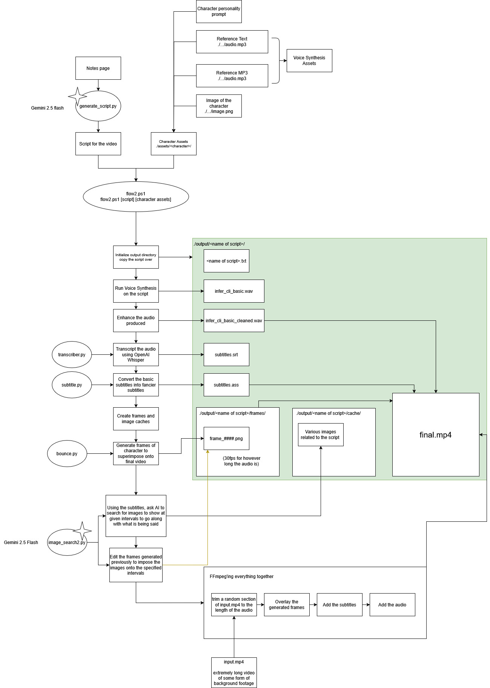

# AP Brainrot

AP Brainrot is a pipeline for generating educational or entertainment videos from scripts and character prompts. It automates the process of turning text and audio into visually engaging videos with synchronized subtitles, character animation, and contextual images, using AI and various Python tools.

## Premise

The program takes a script and a character prompt, generates audio using text-to-speech, transcribes the audio into subtitles, creates animated character frames that bounce in sync with the audio, and overlays relevant images, equations, and diagrams at the correct times. The final output is a video with subtitles, character animation, and contextual visuals, ready for sharing or further editing.

---

## Script Overview

### 1. `single.ps1`

This PowerShell script batch-processes a folder of markdown topic files. For each file:
- Randomly selects a character prompt from the provided target directories.
- Runs `generate_script.py` to create a script based on the topic and character.
- Passes the generated script to `flow.ps1` for full video generation.
- Tracks progress and estimates time remaining.

### 2. `flow.ps1`

This PowerShell script orchestrates the video creation pipeline for a single script and character:
- Copies the script to an output folder.
- Runs text-to-speech (TTS) to generate audio using the character's reference audio and text.
- Cleans the audio with `audio.py`.
- Transcribes the cleaned audio to subtitles with `transcriber.py`.
- Converts subtitles to ASS format with `subtitle.py` for advanced styling.
- Generates animated character frames with `bounce.py`.
- Uses `images.py` to overlay contextual images, equations, and diagrams onto frames based on subtitle timing.
- Combines frames, background video, audio, and subtitles into a final video using ffmpeg.
- Copies the final video to a central `videos` folder.

### 3. `transcriber.py`

A Python script that uses the Faster Whisper model to transcribe audio into SRT subtitles:
- Processes the audio file and outputs word-level timestamps.
- Formats each word as a separate subtitle entry for precise timing.
- Outputs a standard SRT file for use in later steps.

### 4. `subtitle.py`

Converts SRT subtitles to ASS format with word highlighting:
- Groups words into sentences or phrases for better readability.
- Applies advanced styling (font, color, outline, alignment) for clear display.
- Highlights the currently spoken word for karaoke-style effects.
- Outputs an ASS subtitle file for use in video rendering.

### 5. `bounce.py`

Generates animated character frames that bounce in sync with the audio:
- Analyzes the audio to detect pauses and volume changes.
- Scales and moves the character image to create a bouncing effect that matches speech dynamics.
- Outputs a sequence of PNG frames sized 640x1080 for overlaying in the final video.

### 6. `images.py`

Handles image generation and overlay:
- Uses AI (Google Gemini) to generate prompts for relevant images, equations, or diagrams based on the script and subtitles.
- Downloads images from Google Images, renders LaTeX equations, and generates diagrams as needed.
- Superimposes these visuals onto the correct frames at the right timestamps.
- Ensures all visuals fit the 9:16 aspect ratio (640x1080).
- Outputs the final frames for video assembly.

---
## Character Folder setup
This is what needs to be in a character's folder in order to function
./character/
    |
    |- audio.mp3 (5-12 seconds of a character's speech)
    |- ref-text.txt (the transcription of what is said in audio.mp3)
    |- prompt.txt (a prompt to describe the mannerisms and character to the LLM that is going to replicate its speech)
    |- image.png (an image of the character that will bounce around at the bottom of the screen)

---

## Requirements

- Python 3.8+
- PowerShell 5+
- Various Python packages: Pillow, numpy, scipy, matplotlib, wand, selenium, beautifulsoup4, google-generativeai, pedalboard, noisereduce, faster-whisper
- Chrome WebDriver (for Selenium)
- ffmpeg (for video assembly)
- Google Gemini API key (`api.txt`)

---

## Usage

See each script for command-line usage. The typical workflow is to run `single.ps1` for batch processing, or `flow.ps1` for a single video.

---

## License

MIT License.
